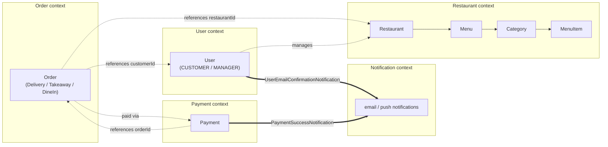
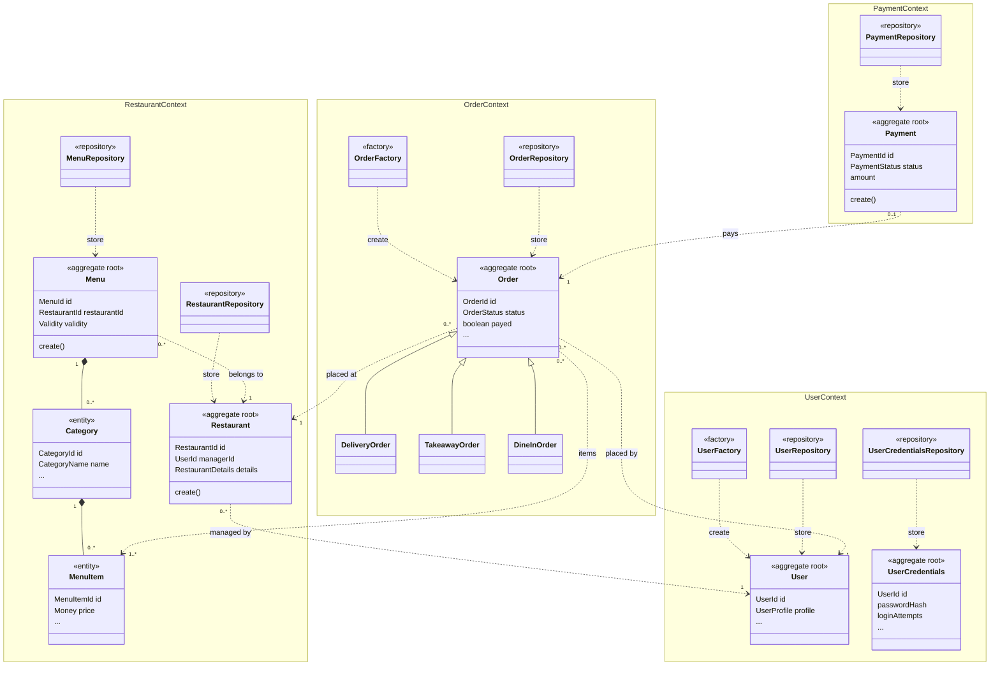

# Domain Model

## Bounded contexts

Each microservice *is* a bounded context — one Kotlin/TypeScript module, one dedicated MongoDB database (see [Microservices](../02-implementation/microservices.md)), one team-sized area of the [ubiquitous language](glossary.md). Nothing reaches across a context boundary except through its published HTTP API or, in a few deliberate cases, an asynchronous event.

### User context

Owns user registration, authentication and profile management. The `User` aggregate and the `CUSTOMER`/`MANAGER` role hierarchy live here.

### Restaurant context

Owns restaurant identity and menu administration: the `Restaurant` and `Menu` aggregates, and everything nested inside a menu (categories, items, variations, validity windows).

### Order context

Owns the order lifecycle across its three fulfilment shapes (delivery, takeaway, dine-in) — the `Order` aggregate and its state machine.

### Payment context

Owns the payment lifecycle for an order — the `Payment` aggregate, modeled independently of `Order` rather than as a field on it.

### Notification context

Owns delivering notifications to users. Unlike the others it has **no inbound HTTP API of its own** — it exists purely to react to events published by other contexts (see the context map below).

### Table Reservation context

Owns table booking. Present in the codebase but incomplete (see [Microservices](../02-implementation/microservices.md)) — excluded from the diagrams and the deployment.



The dotted lines are **references by ID only** (`RestaurantId`, `CustomerId`, `OrderId` — plain value objects, never a foreign key or a shared table) — a hard requirement of the database-per-service split. The double lines are the few asynchronous (Kafka) integrations; every other interaction between contexts is a synchronous REST call through the other context's HTTP API (not drawn; see [Microservices](../02-implementation/microservices.md#communication-between-services)). The asynchronous ones are detailed in the context map below.

## Context map: communication between contexts

Between contexts, communication is synchronous REST by default (gateway routing, `payment-service` confirming an order with `order-service` — see [Microservices](../02-implementation/microservices.md#communication-between-services)) and is not modeled as domain events. This map covers the exception: the few cases where a context tells another that something happened without depending on it, so that the publisher must not fail, slow down or even know whether the consumer is running. For those, contexts exchange domain events through Kafka, following a **Published Language** shape defined once in `commons` (see [Tactical building blocks](#tactical-building-blocks)) and specialized per context. Both current examples target the Notification context.

**Published by the User context**

- `UserEmailConfirmationNotification` — emitted when a user registers, carrying what's needed to send a confirmation email.

**Published by the Payment context**

- `PaymentSuccessNotification` — emitted when a payment for an order completes.

**Consumed by the Notification context**

- `UserEmailConfirmationNotification` (from the User context) — consumed to send the email-verification message.
- `PaymentSuccessNotification` (from the Payment context) — consumed to notify the customer their payment went through.

The Notification context is a pure event sink: it has no HTTP API of its own, two independent Kafka consumers (one per inbound event type), and publishes nothing. Concretely, `user-service` publishes via a `@KafkaClient` ([`EmailConfirmationClient`](https://github.com/Norby99/munchies/blob/master/user-service/src/main/kotlin/com/munchies/user/infrastructure/adapter/outbound/kafka/EmailConfirmationClient.kt)) and `notification-service` consumes it independently ([`KafkaUserEmailConfirmationNotificationConsumer`](https://github.com/Norby99/munchies/blob/master/notification-service/src/main/ts/infrastructure/adapter/inbound/kafka/KafkaUserNotificationConsumer.ts)). Here asynchrony is the point: user registration completes even if the Notification context is temporarily down, because nothing in the registration path waits on the email.

## Tactical building blocks

Rather than reinvent Entity/Value-Object/Aggregate/Repository per context, they're defined once in [`commons`](https://github.com/Norby99/munchies/blob/master/commons/src/commonMain/kotlin/com/munchies/commons/DDD.kt) — a Kotlin Multiplatform module compiled to both JVM and JS (see [Multiplatform](../02-implementation/multiplatform.md)) — and every bounded context extends them:

```kotlin
open class EntityId<Id>(open val value: Id) { /* equality by value */ }
open class Entity<Id : EntityId<*>>(open val id: Id) { /* equality by id */ }
open class AggregateRoot<Id : EntityId<*>>(id: Id) : Entity<Id>(id)
interface Factory<E : Entity<*>>
interface Repository<Id : EntityId<*>, E : Entity<Id>> { fun findById(id: Id): E?; fun save(entity: E); /* ... */ }
```

The event-publishing shape used for the asynchronous cases in the context map above is defined the same way, generically:

```kotlin
interface Notification
interface NotificationObserver<N : Notification> { fun update(event: N) }
interface NotificationSubject<N : Notification, O : NotificationObserver<N>> {
  fun attach(observer: O); fun detach(observer: O); fun emit(event: N)
}
```

— a textbook Observer pattern, `@JsExport`'d so the same contract shape is usable from a Kotlin service or a TypeScript one, which is how `UserEmailConfirmationNotification` and `PaymentSuccessNotification` both end up structured identically despite living in different languages.

## Aggregates, entities and value objects

| Bounded context | Aggregate root(s) | Notable entities | Notable value objects |
| --- | --- | --- | --- |
| User | `User` | — | `UserId`, `UserProfile`, `Email` (with verification state), `UserRole` |
| Restaurant | `Restaurant`, `Menu` | `Category`, `MenuItem` (inside `Menu`) | `RestaurantId`, `RestaurantName`, `Address`, `Phone`, `Email`, `Money`, `Validity`, `Variation` |
| Order | `Order` (sealed: `DeliveryOrder` / `TakeawayOrder` / `DineInOrder`) | — | `OrderId`, `RestaurantId`, `CustomerId`, `OrderItem`, `OrderStatus`, `DeliveryInfo` |
| Payment | `Payment` | — | `PaymentId`, `Currency`, `PaymentMethod`, `PaymentStatus` |

## Class diagram

The class diagram below shows the whole domain at once. It keeps only what carries domain meaning (identifiers, invariants, state transitions) and marks the DDD role of each class with a stereotype: `aggregate root`, `entity`, `factory` or `repository`. Filled diamonds are composition (the part cannot outlive the whole), and dotted arrows across an aggregate or context boundary are references *by identifier only*.

The diagram covers every aggregate in the system, grouped by bounded context. To stay readable it stops at the aggregate level: value objects, enumerations and most attributes are omitted (`...` marks omitted attributes); the value objects of each context are listed in the table above. Each aggregate root is paired with the `Repository` that stores it (`store`) and, where construction is non-trivial, the `Factory` that builds it (`create`); a `create()` operation on the root itself stands for a static factory method (`Restaurant`, `Menu`, `Payment`). Arrows between contexts are identifier references, never object references, which is what keeps each context free to live in its own service and database.



Two points are worth reading off the diagram. First, the only cross-context references in the model are by identifier, and they all point towards the contexts that own the referenced data: `Restaurant` to its managing `User`, `Menu` to its `Restaurant`, and `Order` to the `Restaurant`, the customer `User` and the `MenuItem`s it was placed for; `Payment` refers back to the `Order` it settles. Second, `User` and `UserCredentials` are separate aggregates sharing the same `UserId`, which keeps the password hash apart from the profile.

The `aggregate root` stereotype is the DDD role, not the base class: in the code `Restaurant` and `Menu` extend the `AggregateRoot` marker from `commons`, while `User` and `Order` extend `Entity` directly, each being the sole entity of its aggregate.

!!! note "Not every service names its layers the same way"
    `order-service`, `user-service` and `payment-service` use `domain/model` + `domain/port`; `restaurant-service` uses `domain/aggregate` + `domain/valueobject` + `domain/repository`. Both are valid DDD vocabulary for the same concepts, and the [Konsist architecture tests](../02-implementation/microservices.md) don't care which subfolder names are used — they check the *dependency direction* between domain/application/infrastructure, not folder naming. Worth flagging as a real inconsistency rather than presenting the codebase as more uniform than it is.
