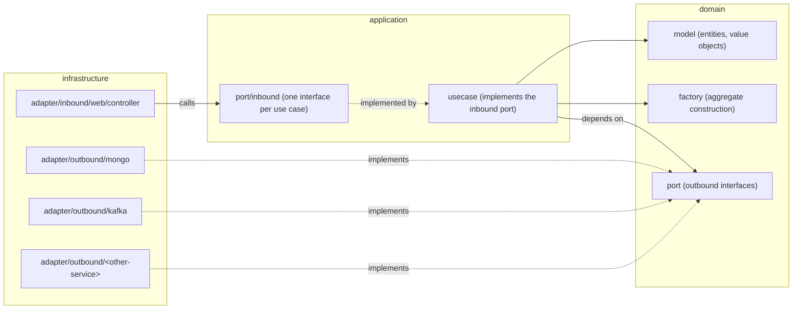
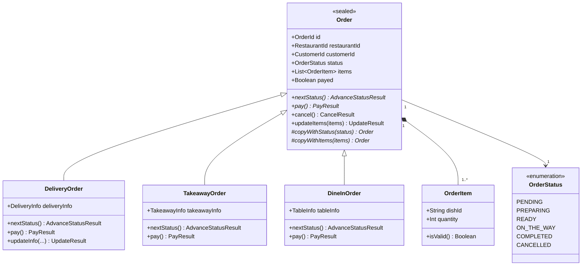
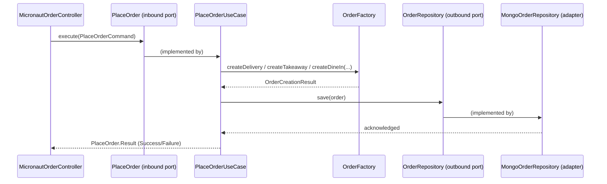

# Domain Model

Every backend microservice in _Munchies_ that owns business logic is structured according to Domain-Driven Design,
inside a Hexagonal (Ports & Adapters) layout: a framework-agnostic **domain** at the center, an **application**
layer orchestrating it into use cases, and an **infrastructure** layer of framework-specific adapters plugged in
from the outside. The same three-layer shape, and the same folder names, are used regardless of stack (Kotlin +
Micronaut or Express.js), so a developer moving from one service to another finds the same layout. This section
describes that structure, its class hierarchy, and how the layers depend on one another, using
[```order-service```](https://github.com/Norby99/munchies/tree/master/order-service/src/main/kotlin/com/munchies/order)
and [```payment-service```](https://github.com/Norby99/munchies/tree/master/payment-service/src/main/ts) — our
reference implementations for Kotlin and Express.js respectively — as concrete examples.

## Layers and dependency direction

The three layers only depend inward: ```infrastructure``` depends on ```application```, which depends on
```domain```, and never the other way around. Whenever the domain needs something from the outside world — persisting
an entity, calling another microservice, publishing a message — it declares an interface for it (a **port**) instead
of depending on the concrete technology. Infrastructure provides an **adapter** implementing that port and is wired
in at startup, so the domain stays entirely ignorant of MongoDB, Kafka, HTTP or any other framework concern.



Solid arrows are plain calls; dashed arrows are the dependency-inversion points, where an outer layer implements an
interface declared by an inner one. This is what lets the domain be tested with pure unit tests, and lets an
adapter (say, the MongoDB repository) be swapped or mocked without touching a single line of business logic.

## Package structure

Every service follows the same folder layout under its module root (```<service>/src/main/kotlin/...``` for Kotlin
services, ```<service>/src/main/ts``` for Express.js ones):

```
domain/
  model/        entities and value objects
  factory/      aggregate construction logic (only where non-trivial)
  port/         outbound interfaces (repository, external clients, publishers)
application/
  usecase/                    one class per use case
  port/inbound/               one inbound port interface per use case
  port/inbound/command/       input Command objects (optional, for non-trivial inputs)
infrastructure/
  adapter/inbound/web/controller/     REST controllers
  adapter/inbound/web/config/         DI wiring, OpenAPI configuration
  adapter/outbound/mongo/document/    Mongo document classes
  adapter/outbound/mongo/repository/  repository implementation
  adapter/outbound/mongo/factory/     domain <-> document mapping
  adapter/outbound/kafka/             Kafka producers/consumers
  adapter/outbound/<other-service>/   clients for other microservices' REST APIs
  adapter/dto/factory/                DTO <-> Command mapping
```

```order-service``` follows it exactly:

```
com/munchies/order/
  domain/
    model/     Order, DeliveryOrder, TakeawayOrder, DineInOrder, OrderItem, OrderStatus, OrderId, ...
    factory/   OrderFactory, OrderCreationResult
    port/      OrderRepository
  application/
    usecase/            PlaceOrderUseCase, PayOrderUseCase, AdvanceOrderStatusUseCase, ...
    port/inbound/       PlaceOrder, PayOrder, AdvanceOrderStatus, ...
    port/inbound/command/  PlaceOrderCommand, PayOrderCommand, ...
  infrastructure/
    adapter/inbound/web/controller/   MicronautOrderController
    adapter/inbound/web/config/       OrderBeans, OpenAPI
    adapter/outbound/mongo/           OrderDocument, MongoOrderRepository, OrderDocumentFactory
    adapter/dto/factory/              OrderDtoFactory, CommandFactory
```

```payment-service```, in Express.js, mirrors the same shape with the language-appropriate file naming:

```
domain/
  model/    Payment, PaymentId
  port/     PaymentRepository, PaymentGateway, OrderServiceClient, PaymentNotificationPublisher
application/
  usecase/         ProcessPaymentUseCase
  port/inbound/    ProcessPayment
infrastructure/
  adapter/inbound/web/controller/    PaymentController
  adapter/inbound/web/config/        PaymentBeans
  adapter/outbound/mongo/            payment-document, payment-mongo-repository, payment-factory
  adapter/outbound/kafka/            KafkaPaymentNotificationPublisher
  adapter/outbound/order/            OrderServiceHttpClient
  adapter/outbound/payment/          FakePaymentGateway
```

## Class hierarchy: the `Order` aggregate

```order-service```'s domain is the clearest example of the class hierarchy this structure enables. ```Order``` is a
Kotlin ```sealed class``` modeling the invariants shared by every kind of order (advancing its status, paying it,
cancelling it, updating its items), while ```DeliveryOrder```, ```TakeawayOrder``` and ```DineInOrder``` are its
concrete subtypes, each overriding ```nextStatus()``` with its own status-transition rules and carrying its own
type-specific information (```DeliveryInfo```, ```TakeawayInfo```, ```TableInfo```).



Every mutation returns a sealed ```Result``` type (```AdvanceStatusResult```, ```PayResult```, ```UpdateResult```,
```CancelResult```) instead of throwing or mutating in place — ```Order``` and its subtypes are immutable data
classes, so a successful operation is expressed as a new ```Order``` instance wrapped in a ```Success```, and every
way it can fail (```InvalidTransition```, ```AlreadyPaid```, ```InvalidItems```, ...) is an explicit, exhaustively
matchable case. Non-trivial construction (validating items, picking the right subtype and its type-specific
information) is factored out of the constructors and into ```OrderFactory```, per the DDD-factory convention.

## Request flow across the layers

The following sequence, for ```PlaceOrder```, shows how a request crosses the three layers and where dependency
inversion kicks in — the use case never talks to MongoDB directly, only to the ```OrderRepository``` port it
depends on:



The controller only ever sees the ```PlaceOrder``` interface, never ```PlaceOrderUseCase``` directly, and the use
case only ever sees the ```OrderRepository``` interface, never ```MongoOrderRepository```. ```payment-service```
follows the identical pattern in Express.js: its ```PaymentController``` depends on the ```ProcessPayment``` inbound
port, and ```ProcessPaymentUseCase``` depends on the ```PaymentRepository``` and ```PaymentGateway``` outbound
ports, implemented respectively by a MongoDB adapter and a fake payment gateway adapter.
