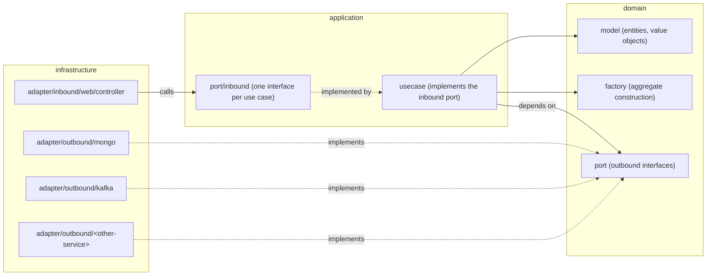
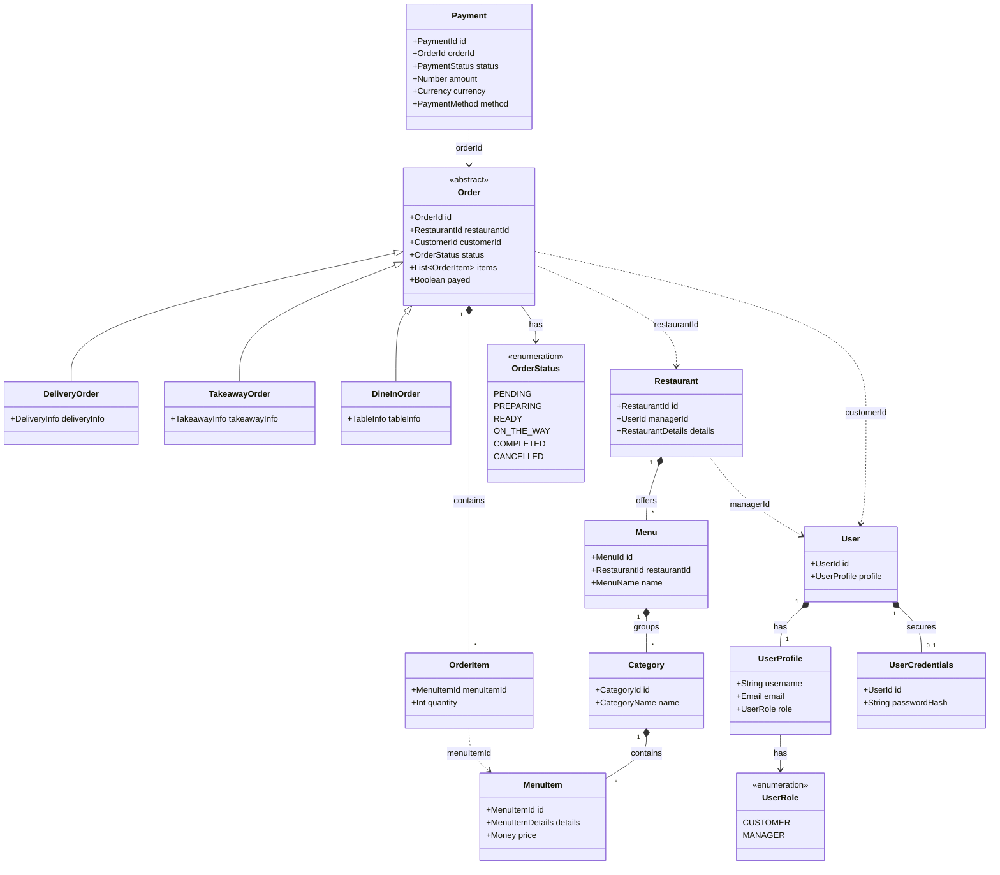

# Domain Model

The backend of _Munchies_ is divided into microservices that follows the Domain-Driven Design, inside a Hexagonal
layout.
Each microservice has the same folder structure and naming regardless of technological stack.

This section describes that structure, its class hierarchy, and how the layers depend on one another, using
[
```order-service```](https://github.com/Norby99/munchies/tree/master/order-service/src/main/kotlin/com/munchies/order) (
implemented in Kotlin)
and [```payment-service```](https://github.com/Norby99/munchies/tree/master/payment-service/src/main/ts) (implemented in
Express).

## Layers and dependency direction

As mentioned above, each microservice follows the Hexagonal layout, with it's ```infrastructure```,  ```application```
and ```domain``` layers:



Solid arrows are plain calls; dashed arrows represent a dependency from another class/interface.

## Package structure

Every service follows the same folder layout under its module root (```<service>/src/main/kotlin/...``` for Kotlin
services, ```<service>/src/main/ts``` for Express.js ones):

```
domain/
  model/        entities and value objects
  factory/      aggregate construction logic (only where non-trivial)
  port/         outbound interfaces (repository, external clients, publishers)
application/
  usecase/                    one class per use case
  port/inbound/               one inbound port interface per use case
  port/inbound/command/       input Command objects (optional, for non-trivial inputs)
infrastructure/
  adapter/inbound/web/controller/     REST controllers
  adapter/inbound/web/config/         DI wiring, OpenAPI configuration
  adapter/outbound/mongo/document/    Mongo document classes
  adapter/outbound/mongo/repository/  repository implementation
  adapter/outbound/mongo/factory/     domain <-> document mapping
  adapter/outbound/kafka/             Kafka producers/consumers
  adapter/outbound/<other-service>/   clients for other microservices' REST APIs
  adapter/dto/factory/                DTO <-> Command mapping
```

## Class hierarchy: the `Order` aggregate

Here is a high level representation of the domain model of the system.


