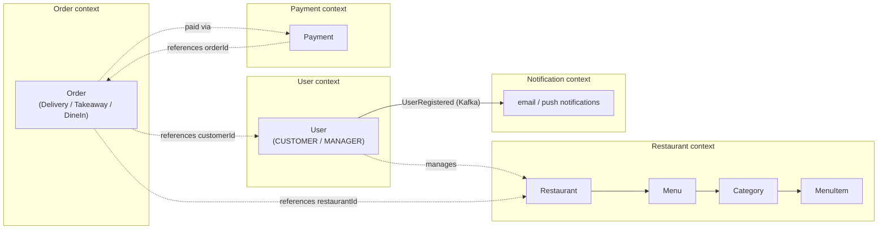

# Domain Model

## Bounded contexts

Each microservice *is* a bounded context — one Kotlin/TypeScript module, one dedicated MongoDB database (see [Microservices](../02-implementation/microservices.md)), one team-sized area of the ubiquitous language. Nothing reaches across a context boundary except through its published HTTP API or an asynchronous event.



The dotted lines are **references by ID only** (`RestaurantId`, `CustomerId`, `OrderId` — plain value objects, never a foreign key or a shared table) — a hard requirement of the database-per-service split. The one solid arrow is a real asynchronous integration, covered below.

## Tactical building blocks

Rather than reinvent Entity/Value-Object/Aggregate/Repository per service, they're defined once in [`commons`](https://github.com/Norby99/munchies/blob/master/commons/src/commonMain/kotlin/com/munchies/commons/DDD.kt) — a Kotlin Multiplatform module compiled to both JVM and JS (see [Multiplatform](../02-implementation/multiplatform.md)) — and every bounded context extends them:

```kotlin
open class EntityId<Id>(open val value: Id) { /* equality by value */ }
open class Entity<Id : EntityId<*>>(open val id: Id) { /* equality by id */ }
open class AggregateRoot<Id : EntityId<*>>(id: Id) : Entity<Id>(id)
interface Factory<E : Entity<*>>
interface Repository<Id : EntityId<*>, E : Entity<Id>> { fun findById(id: Id): E?; fun save(entity: E); /* ... */ }
```

Sharing this once, instead of copy-pasting an `EntityId` per service, means the *definition* of "what counts as an entity here" is enforced consistently rather than by convention alone.

## Aggregates, entities and value objects

| Bounded context | Aggregate root(s) | Notable entities | Notable value objects |
| --- | --- | --- | --- |
| User | `User` | — | `UserId`, `UserProfile`, `Email` (with verification state), `UserRole` |
| Restaurant | `Restaurant`, `Menu` | `Category`, `MenuItem` (inside `Menu`) | `RestaurantId`, `RestaurantName`, `Address`, `Phone`, `Email`, `Money`, `Validity`, `Variation` |
| Order | `Order` (sealed: `DeliveryOrder` / `TakeawayOrder` / `DineInOrder`) | — | `OrderId`, `RestaurantId`, `CustomerId`, `OrderItem`, `OrderStatus`, `DeliveryInfo` |
| Payment | `Payment` | — | `PaymentId`, `Currency`, `PaymentMethod`, `PaymentStatus` |

Three patterns worth calling out, because they're not just "an entity with fields":

### Polymorphic aggregate with an invariant-guarded lifecycle — `Order`

`Order` is a `sealed class` with three concrete shapes (`DeliveryOrder`, `TakeawayOrder`, `DineInOrder`), so the compiler — not a runtime `when` with a default branch — guarantees every order-fulfilment path is handled. State transitions aren't free-form field assignment:

```kotlin
fun cancel(): CancelResult {
  if (status != OrderStatus.PENDING) return CancelResult.Failure.InvalidTransition
  return CancelResult.Success(copyWithStatus(OrderStatus.CANCELLED))
}
```

An order can only be cancelled while `PENDING` — the invariant lives inside the aggregate itself, not in a controller or a service class that could forget to check it. Every mutation (`nextStatus()`, `pay()`, `updateItems()`) returns a sealed `Result` type (`Success`/`Failure`) instead of throwing, so callers are forced by the type system to handle rejection instead of relying on a try/catch they might omit.

### Construction through a validating factory — `User`

```kotlin
class User private constructor(override val id: UserId, val profile: UserProfile) : Entity<UserId>(id) {
  companion object {
    val factory: UserFactory = DefaultUserFactory()
  }
}
```

The constructor is `private` — the *only* way to obtain a `User` is `User.factory.create(...)`, which validates the nested `UserProfile` (non-empty username, non-empty email) and returns a `Success`/`Failure` result. It is not possible to hold a reference to an invalid `User` anywhere in the codebase; the type system rules it out. `Restaurant` and `Menu` follow the same private-constructor-plus-companion-factory shape.

### Composite value object — `Validity`

```kotlin
sealed interface Validity {
  fun isValid(date: LocalDateTime): Boolean
  fun combine(other: Validity): Validity = And(this, other)
  // variants: Period, Weekly, Yearly, Hours, Always, And
}
```

A menu item's availability window is expressed by composing simple rules (`Validity.hours(11, 14).combine(Validity.weekly(listOf(6, 7)))` — "weekend lunch only") rather than a single flat `startDate`/`endDate`/`daysOfWeek` struct with implicit AND semantics. This is the textbook Composite pattern applied to a value object: `And` is itself a `Validity` holding two `Validity`s.

## Context integration: domain events over Kafka

The one cross-context arrow in the diagram above is deliberately **not** a synchronous HTTP call. When a user registers, `user-service` publishes to Kafka via a `@KafkaClient` ([`EmailConfirmationClient`](https://github.com/Norby99/munchies/blob/master/user-service/src/main/kotlin/com/munchies/user/infrastructure/adapter/outbound/kafka/EmailConfirmationClient.kt)); `notification-service` consumes it independently ([`KafkaUserNotificationConsumer`](https://github.com/Norby99/munchies/blob/master/notification-service/src/main/ts/infrastructure/adapter/inbound/kafka/KafkaUserNotificationConsumer.ts)) and sends the confirmation email. Neither context calls the other directly or knows whether the other is even running at the moment the event is published — the User context doesn't need Notification to be healthy to finish registering a user, which is exactly the point of modeling this as an event rather than a request/response call.

The publish/subscribe shape itself is also captured once, generically, in `commons`:

```kotlin
interface Notification
interface NotificationObserver<N : Notification> { fun update(event: N) }
interface NotificationSubject<N : Notification, O : NotificationObserver<N>> {
  fun attach(observer: O); fun detach(observer: O); fun emit(event: N)
}
```

— a textbook Observer pattern, `@JsExport`'d so the same contract shape is usable from a Kotlin service or a TypeScript one.

!!! note "Not every service names its layers the same way"
    `order-service`, `user-service` and `payment-service` use `domain/model` + `domain/port`; `restaurant-service` uses `domain/aggregate` + `domain/valueobject` + `domain/repository`. Both are valid DDD vocabulary for the same concepts, and the [Konsist architecture tests](../02-implementation/microservices.md#enforced-boundaries) don't care which subfolder names are used — they check the *dependency direction* between domain/application/infrastructure, not folder naming. Worth flagging as a real inconsistency rather than presenting the codebase as more uniform than it is.
