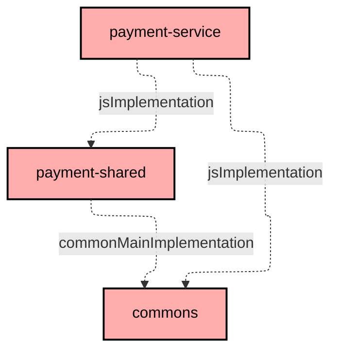
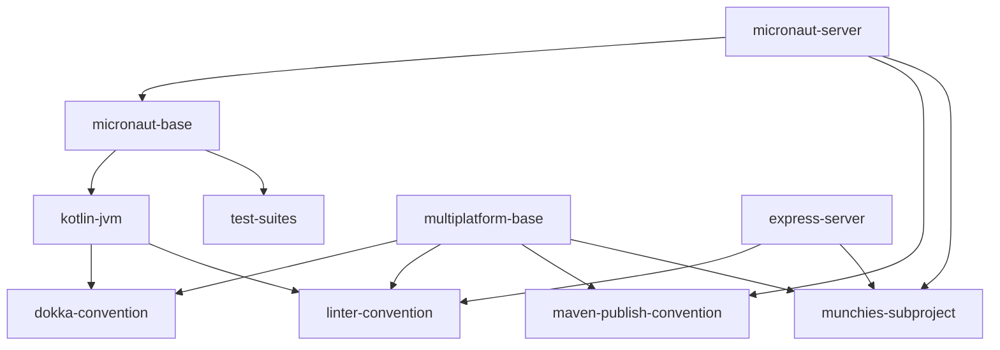

# Project Structure & Build System

This project uses Gradle as its build system.

## Project Structure

_Munchies_ is a *monorepo* with a *multi project* structure. These are the project available inside the repository:

- ```architecture-rules``` (Kotlin): contains Konsist's architectural tests for a clean DDD architecture
- ```commons``` (Multiplatform): contains common code for all other projects
- ```e2e-test``` (Kotlin): contains end-to-end tests for the services
- ```frontend-service``` (TypeScript): contains the code for the frontend
- ```gateway-service``` (TypeScript): contains the gateway's microservice code
- ```gateway-shared``` (Multiplatform): contains the gateway's API signatures
- ```notification-service``` (TypeScript): contains the notification's microservice code
- ```notification-shared``` (Multiplatform): contains the notification's API signatures
- ```order-service``` (Kotlin): contains the order's microservice code
- ```order-shared``` (Multiplatform): contains the order's API signatures
- ```payment-service``` (TypeScript): contains the payment's microservice code
- ```payment-shared``` (TypeScript): contains the payment's API signatures
- ```restaurant-service``` (Kotlin): contains the restaurant's microservice code
- ```restaurant-shared``` (Multiplatform): contains the restaurant's API signatures
- table-reservation-service (TypeScript): contains the table reservation's microservice code (INCOMPLETE)
- table-reservation-shared (Multiplatform): contains the table reservation's API signatures (INCOMPLETE)
- ```user-service``` (Kotlin): contains the user's microservice code
- ```user-shared``` (Multiplatform): contains the user's API signatures

Meanwhile, these folders:

- ```build-logic```: contains the Gradle conventions, tasks and configurations for the projects
- ```config```: contains the detekt and docker images configurations
- ```docs```: contains the internal and external documentation
- ```k8s```: contains the Kubernetes configurations
- ```loadtest```: contains a minikube load testing configuration with autoscaling
- ```scripts```: contains the script for building documentation, publishing to NPM, DockerHub, Maven and a script to
  deploy and run our project.

## Build System

Our project heavely relies on Gradle to test, compile, build artifacts and run.

We've written custom _tasks_ that allow to link and execute commands in different platform such as the JVM and Node;
this was possible by a plugin which allows Gradle to run npm commands.
We linked the ```./gradlew build``` command to also run a TypeScript project's ```npm run build``` using a
multiplatform's generated JavaScript code, which is beforehand compressed in a .tgz archive in order to have the
up-to-date code.

We've also created tasks to create the service's dockerfiles', their images and link them via a
```./gradlew composeUp``` to run the whole project with a single command, furthermore ```showDb``` tasks were created to
better analyze the mongodb containers running.
These dockerfiles and images, were also used to be able to utilize kubernetes as a deployment method instead of docker.

We've also created two tasks to help during the deploy-docs workflow that copies the generated docs to be then further
translated into a web page.

Lastly, we've created a ```./gradlew graphUpdate``` task which updates a [
```README.md```](https://github.com/Norby99/munchies/blob/master/order-service/README.md) file for each Gradle
subproject that displays its dependencies to other subprojects.

An example:




## Shared build logic

Many subproject share the same build logic configuration, that are defined in the ```build-logic``` folder, these
conventions also have a hierarchical structure.

These are the currenct build conventions available:

- dokka-convention
- express-server
- kotlin-jvm
- linter-convention
- maven-publish-convention
- micronaut-base
- micronaut-server
- multiplatform-base
- munchies-subproject
- test-suites



## Dependencies
