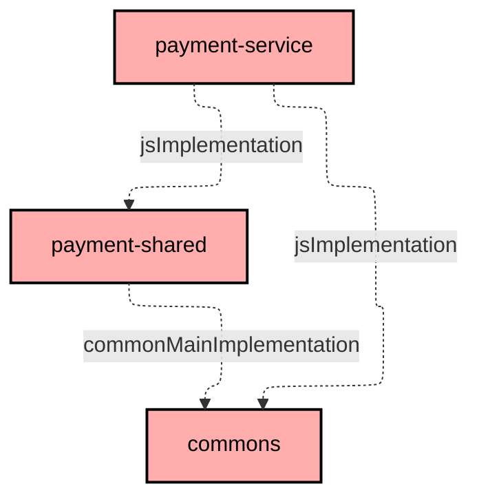
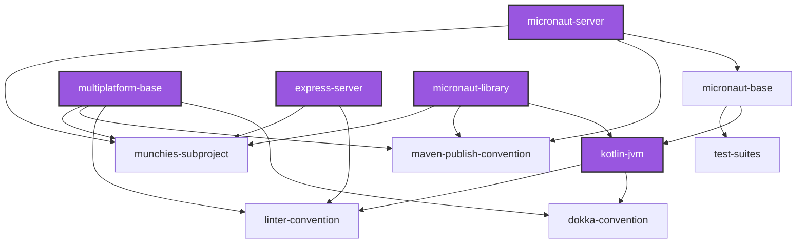

# Project Structure & Build System

This project uses Gradle as its build system.

## Project Structure

_Munchies_ is a *monorepo* with a *multi project* structure. These are the project available inside the repository:

- ```architecture-rules``` (Kotlin): contains Konsist's architectural tests for a clean DDD architecture
- ```commons``` (Multiplatform): contains common code for all other projects
- ```e2e-test``` (Kotlin): contains end-to-end tests for the services
- ```frontend-service``` (TypeScript): contains the code for the frontend (INCOMPLETE)
- ```gateway-service``` (TypeScript): contains the gateway's microservice code
- ```gateway-shared``` (Multiplatform): contains the gateway's API signatures
- ```micronaut-commons``` (Kotlin): contains Micronaut beans shared across every JVM microservice — currently a
  custom `MongoHealthIndicator`, added to close a gap in `/health` (see below)
- ```notification-service``` (TypeScript): contains the notification's microservice code
- ```notification-shared``` (Multiplatform): contains the notification's API signatures
- ```order-service``` (Kotlin): contains the order's microservice code
- ```order-shared``` (Multiplatform): contains the order's API signatures
- ```payment-service``` (TypeScript): contains the payment's microservice code
- ```payment-shared``` (TypeScript): contains the payment's API signatures
- ```restaurant-service``` (Kotlin): contains the restaurant's microservice code
- ```restaurant-shared``` (Multiplatform): contains the restaurant's API signatures
- table-reservation-service (TypeScript): contains the table reservation's microservice code (INCOMPLETE)
- table-reservation-shared (Multiplatform): contains the table reservation's API signatures (INCOMPLETE)
- scheduler-service (Typescript): contains the order scheduler microservice code (INCOMPLETE)
- ```user-service``` (Kotlin): contains the user's microservice code
- ```user-shared``` (Multiplatform): contains the user's API signatures

Meanwhile, these folders:

- ```build-logic```: contains the Gradle conventions, tasks and configurations for the projects
- ```config```: contains the detekt and docker images configurations
- ```docs```: contains the internal and external documentation
- ```k8s```: contains the Kubernetes configurations
- ```loadtest```: contains a minikube load testing configuration with autoscaling
- ```scripts```: contains the script for building documentation, publishing to NPM, DockerHub, Maven and a script to
  deploy and run our project.

## Build System

Our project heavely relies on Gradle to test, compile, build artifacts and run.

We've written custom _tasks_ that allow to link and execute commands in different platform such as the JVM and Node;
this was possible by a plugin which allows Gradle to run npm commands.
We linked the ```./gradlew build``` command to also run a TypeScript project's ```npm run build``` using a
multiplatform's generated JavaScript code, which is beforehand compressed in a .tgz archive in order to have the
up-to-date code.

We've also created tasks to create the service's dockerfiles', their images and link them via a
```./gradlew composeUp``` to run the whole project with a single command, furthermore ```showDb``` tasks were created to
better analyze the mongodb containers running.
These dockerfiles and images, were also used to be able to utilize kubernetes as a deployment method instead of docker.

We've also created two tasks to help during the deploy-docs workflow that copies the generated docs to be then further
translated into a web page.

These are all the tasks we've created:

```
Munchies tasks
--------------
composeBuild - Builds images for services of docker-compose project
composeDown - Stops and removes containers of docker-compose project (only if stopContainers is set to true)
composeShowDb - Shows MongoDB data for a service. Usage: ./gradlew composeShowDb -Pservice=<name> [-Pcollection=<name>]
composeUp - Builds and starts containers of docker-compose project
deploy - Deploys all services to Minikube. Usage: ./gradlew deploy
deployServices
dockerBuild
dockerCreate
graphDump - Dumps project dependencies to a mermaid file.
graphUpdate - Updates Markdown file with the corresponding dependency graph.
k8sInfo - Prints the current pods and deployments across all namespaces in Minikube (except for kubernetes' pods).
moveJsDeps
pack_commons
pack_gateway-shared
pack_notification-shared
pack_order-shared
pack_payment-shared
pack_restaurant-shared
pack_table-reservation-shared
pack_user-shared
printJsDeps
run
showDb - Shows MongoDB data for a specific service. Usage: ./gradlew showDb -Pservice=<name> [-Pcollection=<name>]
showKf - Tails a Kafka topic from Minikube. Usage: ./gradlew showKf -Ptopic=<name>
test
typeDocs
undeploy - Undeploys all services from Minikube. Usage: ./gradlew undeploy [-PwipeData=true]
undeployServices
vitestCoverageVerify
```

Lastly, we've created a ```./gradlew graphUpdate``` task which updates a [
```README.md```](https://github.com/Norby99/munchies/blob/master/order-service/README.md) file for each Gradle
subproject that displays its dependencies to other subprojects.

An example:



## Shared build logic

Many subproject share the same build logic configuration, that are defined in the ```build-logic``` folder, these
conventions also have a hierarchical structure.

These are the current build conventions available:

- ```dokka-convention```: dokka configuration for jvm projects
- ```express-server```: configuration for TypeScript projects
- ```kotlin-jvm```: base jvm configuration
- ```linter-convention```: linter for both Kotlin and TypeScript
- ```maven-publish-convention```: configuration for maven publishing
- ```micronaut-base```: micronaut base plugins
- ```micronaut-library```: minimal Micronaut setup (KSP annotation processing + allopen) for a plain library
  module that contributes beans to every service, without the `application`/Docker/AOT machinery a full service
  needs
- ```micronaut-server```: Kotlin micronaut service configuration
- ```multiplatform-base```: Kotlin Multiplatform configuration
- ```munchies-subproject```: subproject with dependency README
- ```test-suites```: component and integration configuration for Micronaut services



### Express Server Convention
Many of our subproject are developed in TypeScript, as such we needed to find a way to share the same functionalities and code between JVM, Multiplatform and TypeScript subprojects.

We did so through the [express-server.gradle.kts](https://github.com/Norby99/munchies/blob/master/build-logic/src/main/kotlin/express-server.gradle.kts), which is tasked with integrating Gradle's most used tasks (clean, build, run) into a npm-reliant subsystem;
this was done through a plugin which allows Gradle to run npm commands and a custom dependency (```jsImplementation```) between subproject that builds, archives and links JavaScript modules from Multiplaform subprojects.

We've decided to go along with these steps, so that during the development of TypeScript subprojects the library dependencies would align with the local version and as a result be up-to-date.

### Micronaut Library Convention

Not every shared piece of code between our JVM services is a plain Kotlin class — some of it needs to be a real
Micronaut *bean*, picked up automatically by every service's dependency-injection context. A plain
```kotlin-jvm``` module can't do that: Micronaut only turns a class into an injectable bean if it was compiled
with Micronaut's own KSP annotation processor, which a bare Kotlin module doesn't run.

This came up concretely while investigating why our Kubernetes `readinessProbe` — which gates whether a pod
receives traffic — couldn't be fully trusted: Micronaut's Kafka health indicator does a genuine broker
round-trip, but no equivalent exists for our MongoDB setup (the built-in one only ships for the *reactive*
driver, and our services use the synchronous one through Micronaut Data). Rather than copy-paste a fix into
`user-service`, `order-service` and `restaurant-service` individually, we wrote it once, as a real shared
Micronaut bean.

[```micronaut-library.gradle.kts```](https://github.com/Norby99/munchies/blob/master/build-logic/src/main/kotlin/micronaut-library.gradle.kts)
is the minimal convention that makes this possible: just enough Micronaut (KSP processing, `allopen`) for a
project's classes to become real beans, without the ```io.micronaut.application```, Docker or AOT machinery a
full deployable service needs.

```kotlin
plugins {
  id("kotlin-jvm")
  id("org.jetbrains.kotlin.plugin.allopen")
  id("com.google.devtools.ksp")
  id("io.micronaut.library")
}
```

[```micronaut-commons```](https://github.com/Norby99/munchies/tree/master/micronaut-commons) is the one project
using it, currently holding a single class: a custom `MongoHealthIndicator` that pings MongoDB through the
synchronous client our repositories already use, so `/health` genuinely reflects whether a pod can reach its
database — verified live, not just assumed, by watching `/health` flip to `503` when Mongo was stopped. Every
service using the ```micronaut-server``` convention pulls it in with a single line:

```kotlin
implementation(project(":micronaut-commons"))
```

— so the fix exists once and every JVM service gets it automatically, the same "write it once, share it" idea
the Express Server Convention above applies to the TypeScript side.