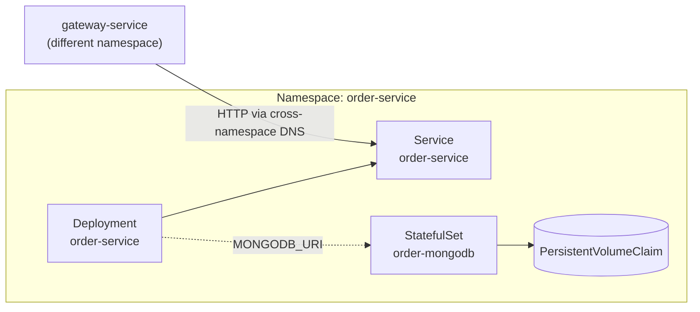

# Deployment

To satisfy the *deploy automation* requirement, _munchies_ is deployable through two complementary paths: **Docker Compose** for local development and integration testing, and **Kubernetes** as a production-shaped orchestration target. Both are built on top of the same containerization step and are driven by the same Gradle-based automation described in [Project Structure](03-devops/project-structure.md).

## Containerization

Every microservice, regardless of its runtime, is packaged into a Docker image by a dedicated Gradle task (`dockerBuild`), but the two platforms build that image differently:

- **Micronaut (JVM) services** use the `io.micronaut.application` Gradle plugin, which generates a **layered Dockerfile** on top of `eclipse-temurin:21-jre`: dependency jars, application classes and resources are copied into separate image layers, so that rebuilding after a source change only invalidates the small application layer instead of the whole image.
- **Express (Node.js) services** are packaged by a custom convention plugin ([`express-server.gradle.kts`](https://github.com/Norby99/munchies/blob/master/build-logic/src/main/kotlin/express-server.gradle.kts)) that programmatically generates a Dockerfile on top of `node:24-alpine`, installing dependencies and running the TypeScript build inside the image.

From a developer's point of view the two are indistinguishable: `./gradlew :<service>:dockerBuild` always produces a `<service>:latest` image, and every higher-level task (Compose, Kubernetes deploy) simply builds every service this way before using it.

## Local Orchestration: Docker Compose

For local development and for the end-to-end test suite, the whole system is described by a single `docker-compose.yml` assembled from three files under [`config/`](https://github.com/Norby99/munchies/tree/master/config): one for Kafka, one for the per-service MongoDB instances, and one for the services themselves. The topology mirrors the domain boundaries established by DDD:

- **Database-per-service** — every microservice owns a dedicated MongoDB container; no service ever reaches into another service's database.
- **Shared event backbone** — a single Kafka broker is used by every service that needs asynchronous, event-driven communication.
- **Health-gated startup** — each container declares a `healthcheck` (a `curl`/`wget` against the service's `/health` endpoint, or a native check for Kafka/Mongo), and `depends_on: condition: service_healthy` ensures a service is only started once its dependencies are actually ready, not just running.

As with containerization, this is hidden behind Gradle: `./gradlew composeUp` compiles the sources, builds the Docker images and starts the whole network of containers in one command; `./gradlew composeDown` tears it down.

## Container Orchestration: Kubernetes

Docker Compose is excellent for development, but it does not model the properties expected of a real deployment target: declarative replica management, self-healing, cluster-wide service discovery, and — critically for this report — horizontal scaling. To validate these properties concretely, _munchies_ also ships a full set of Kubernetes manifests under [`k8s/`](https://github.com/Norby99/munchies/tree/master/k8s), exercised against a local **Minikube** cluster.

### Manifest structure

The `k8s/` folder mirrors, at the infrastructure level, the same per-service isolation already enforced by DDD and by Docker Compose: every microservice gets its own **Namespace**, named after the service, containing:

- a **Deployment**, describing the desired replica count and the pod template for the service's container;
- a **Service**, giving the Deployment's pods a stable DNS name (`<service>.<namespace>.svc.cluster.local`) and load-balancing traffic across whichever replicas are currently ready — this is the exact mechanism that makes the horizontal scaling described below possible;
- for every stateful service (all of them except the gateway, which is stateless by design), a **StatefulSet** and a **PersistentVolumeClaim** for its dedicated MongoDB instance, so that the database keeps a stable network identity and its data across restarts — something a plain Deployment does not guarantee.

Kafka, shared across services, follows the same pattern (a `StatefulSet` plus a headless `Service` for stable per-broker addressing) in its own namespace.

### Readiness and self-healing

Every Deployment declares a `readinessProbe` against the `/health` endpoint that Micronaut exposes out of the box via `micronaut-management`. A pod only joins its Service's load-balancing pool once that probe succeeds, which is what makes both rolling updates and, as covered in the [Benchmark](05-benchmark.md) chapter, autoscaling safe operations.

!!! note "Closing a gap: readiness now also covers MongoDB"
    Investigating this endpoint surfaced a real gap: Micronaut's Kafka health indicator performs a genuine check (it asks the broker's `AdminClient` to describe the cluster), but the equivalent MongoDB indicator only ships for the *reactive* Mongo driver — our services use the synchronous driver through Micronaut Data, so that bean was never created and `/health` never reflected MongoDB connectivity.

    We closed the gap with a small custom `HealthIndicator` ([`MongoHealthIndicator`](https://github.com/Norby99/munchies/blob/master/micronaut-commons/src/main/kotlin/com/munchies/platform/health/MongoHealthIndicator.kt)), packaged once in a shared `micronaut-commons` module and pulled in by every Micronaut service through the `micronaut-server` convention plugin — no per-service duplication. It runs a lightweight `ping` against the already-wired synchronous `MongoClient`. Verified directly against a running container: with Mongo reachable, `/health` reports `"mongodb": {"status": "UP", "details": {"ping": 1.0}}`; with Mongo stopped, the endpoint returns HTTP 503 with `"mongodb": {"status": "DOWN", "details": {"error": "MongoTimeoutException: ..."}}`. A pod losing its database connection is now correctly pulled out of its Service's load-balancing pool.

### Automating the deploy

Deployment to Kubernetes follows the same "hide it behind Gradle" philosophy used for Docker Compose. A custom task, [`deployServices`](https://github.com/Norby99/munchies/blob/master/build-logic/src/main/kotlin/utils/k8s/DeployServicesTask.kt), backs the `./gradlew deploy` command (optionally scoped to one service with `-Pservice=<name>`) and, for every discovered service:

1. builds its Docker image with the same per-language mechanism described above;
2. loads that image directly into the Minikube node (`minikube image load`), since the cluster is configured with `imagePullPolicy: Never`;
3. applies its manifests — the `Namespace` first, then everything else in the folder;
4. issues a `rollout restart` so already-running pods pick up the freshly built image (the tag never changes, so Kubernetes would not otherwise notice a new build).

The dual `./gradlew undeploy` command tears the environment down, keeping `PersistentVolumeClaims` (and therefore data) by default, or wiping everything with `-PwipeData=true`. `./gradlew k8sInfo` gives a quick view of every pod and deployment currently running across the cluster.

!!! warning "Minikube, not production"
    This setup validates that the manifests and the orchestration primitives themselves are correct on a single-node cluster; it is not a production rollout. Two shortcuts would need to be revisited for a real multi-node cluster: images are loaded directly into the node instead of being pulled from a registry (`imagePullPolicy: Never`), and manifests reference the floating `:latest` tag rather than the versioned images that the [release pipeline](03-devops/cicd.md) already publishes to Docker Hub — the two pipelines are not yet connected.

### Reducing manifest duplication with Helm

`k8s/order-service/`, `k8s/user-service/` and `k8s/restaurant-service/` used to be near-identical manifest sets (the restaurant one was in fact cloned from order's, with names swapped) — every stateful service repeated the same Deployment/Service/HPA/StatefulSet/PVC shape. We replaced them with a generic [`munchies-service`](https://github.com/Norby99/munchies/blob/master/helm/munchies-service) Helm chart, parameterized on service name, image, env vars, and whether the service owns a Mongo instance, with one small values file per service under [`helm/values/`](https://github.com/Norby99/munchies/blob/master/helm/values).

We verified it the same way we verify everything else here, *before* removing anything: rendered each values file with `helm template` and diffed the result, structurally, against the hand-written manifests it was meant to replace. All four services rendered **byte-for-byte identical**, aside from the `Namespace` object (the chart leaves that to `helm install --create-namespace`) and one deliberate addition, a `helm.sh/resource-policy: keep` annotation on the Mongo PVC so `helm uninstall` preserves data the same way the raw-manifest path already did. Only then did we delete the four `k8s/{gateway,user,order,restaurant}-service/` folders and update [`DeployServicesTask`](https://github.com/Norby99/munchies/blob/master/build-logic/src/main/kotlin/utils/k8s/DeployServicesTask.kt) to run `helm upgrade --install` for any service that has a `helm/values/<service>.yaml`, falling back to raw `kubectl apply` for the rest (`kafka`, `payment-service`, `notification-service`, `table-reservation-service`). `./gradlew deploy -Pservice=<name>` and `./gradlew deploy` work exactly as before — which path runs underneath is an implementation detail the command line doesn't expose.

## Horizontal Scaling

Every service deployed to Kubernetes (`gateway`, `user`, `order` and `restaurant`) additionally ships a `HorizontalPodAutoscaler` (`k8s/<service>/hpa.yml`, `autoscaling/v2`) targeting 60% average CPU utilization relative to the pod's declared `resources.requests.cpu`, between 1 and 4 replicas. This is what turns the load-balancing Service described above into an autonomously scaling one: as load increases, the cluster provisions more replicas on its own, and scales back down once the load subsides.

Whether this actually works — and by how much throughput improves as replicas increase — is verified empirically with an in-cluster load test, covered in the [Benchmark](05-benchmark.md) chapter.
