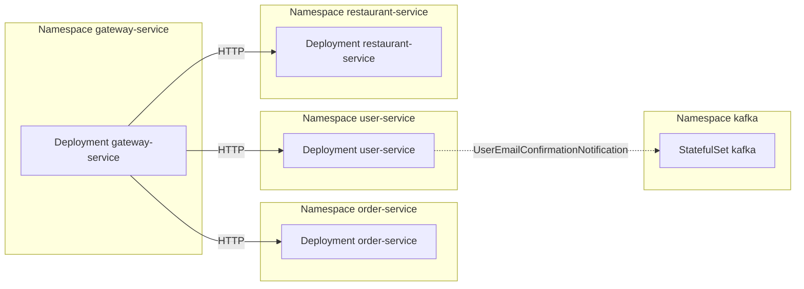
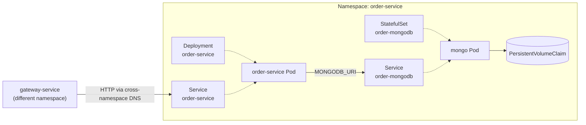
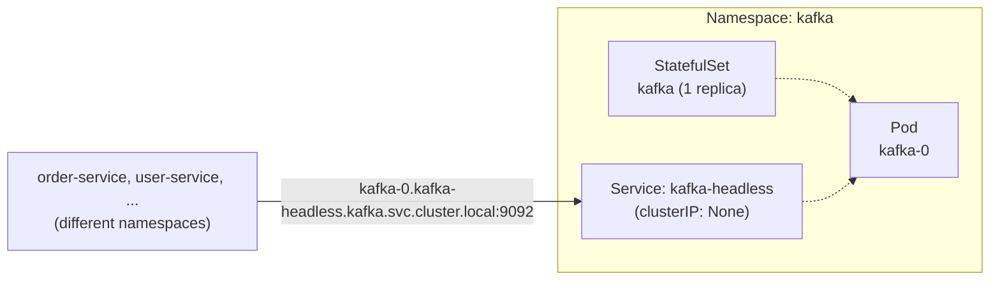

# Deployment

For the deployment stage, we structured it by two complementary phases:
- **Containerization**: achieved using Docker and Gradle plugins
- **Orchestration**: achieved using Kubernetes and Helm for templating configurations

## Containerization

### Docker Build
In the containerization phase, every service builds a Docker image thanks to a process
defined in the Gradle task `dockerBuild`, regardless of its stack.
Two ways possible:
- For **Micronaut** services: the `io.micronaut.application` plugin generates it layered,
by the `BuildLayersTask`, that splits an image into separate layers for dependency jars,
application classes and resources. This allows to reduce build time by not downloading
dependencies every time, exploiting Docker's caching.
- For **Express** services: the `express-server.gradle.kts` configures manually all the steps
to build the image, copying libraries and setting up the Dockerfile.

### Docker Compose
We then configured tasks from `com.avast.gradle.docker-compose` for handling 
the automatic launch of the project containers in `com.munchies.tasks.compose`
and named respectively `composeBuild`, `composeUp` and `composeDown`.
The docker compose configuration files are used by these tasks, are located in 
`config/` folder and define properties and constraints like on what container
the compose depends on.
`composeUp` and `composeDown` respectively start or shut the containers, while `composeBuild` 
builds them while ensuring the different management for image composition depending
on the platform.
We finally defined a task `composeShowDb` to show the current state of the containerized
databases.

## Orchestration

### Kubernetes
As a strong standard for deployment, we decided to use **Kubernetes** for handling the container
orchestration.
We decided to use a namespace per service, so that each bounded context's boundary is reflected
in the infrastructure, not just in the code.

Here's the architecture at a high level:


Here's the zoom in on one namespace service:


Configuration files are defined in the `k8s/` folder and are:
- for `notification`, `payment` and `table-reservation`: *Namespace*, *Deployment*, *Service*,
*StatefulSet* and a *PersistentVolumeClaim*
- for `kafka`: *Namespace*, *StatefulSet* and a headless *Service* (`clusterIP: None`), 
necessary for Kafka clients to reach their broker by name instead of a load-balanced address.

Here's the Kafka setup:


#### Helm
We used **Helm** for services like `user`, `restaurant`, `order` and `gateway`
because the writing of the k8s configuration files was almost a copypaste.
Helm allowed us to template a generic chart named `munchies-service` parametrized on 
service name, image, environment variables, and whether it owns a Mongo instance (composed by a
*StatefulSet* and a *PersistentVolumeClaim*). 
See `helm/values` for files parametrizing the chart. 
There's no *Namespace* definition in the templates because it is handled by Helm
with the option `--create-namespace`.

To deploy:
```
helm upgrade --install <service> helm/munchies-service \
  -n <service> \
  --create-namespace \
  -f helm/values/<service>.yaml
```
Those templates also defined the *readinessProbe*, that tells Kubernetes if a pod
is ready and can handle requests. This made clear a problem about how Micronaut handles
Mongo's readiness: even if the database isn't reachable the service pod equally seems to be
ready (according to `/health` endpoint) and that brings us to the next section.

#### Mongo health gap
In contrast to how Kafka health indicator was correctly handled, for MongoDB Micronaut has
a certain policy: it brings an `HealthIndicator` only for the *reactive* driver. Since our
services use different libraries (`micronaut-data-mongodb` + `mongodb-driver-sync`), that is not 
automatically shipped, so when asking a Micronaut pod its readiness, it answers as if it had 
no MongoDB dependency to check. 
So, this is why it was necessary to implement a `MongoHealthIndicator` into a `micronaut-commons`
new subproject to be importable to all `micronaut-server` services, bringing MongoDB connectivity
into the health check.

#### Deployment automation
Then we moved on to automate the deployment stage defining a `deploy` task depending on
a `DeployServicesTask`. The latter builds the image, loads it with `minikube image load` and
applies the service manifest, if defined, or uses the `helm upgrade --install` if the helm
value exists. An `undeploy` task based on `UndeployServicesTask` was also made to tear down 
the pods, keeping *PersistentVolumeClaim* by default, or deleting them with flag 
`-PwipeData=true`. In the end, a `k8sInfo` was configured to list the current pods deployed,
a `showDb` to show the mongo for a certain service and a `showKf` to tail a Kafka topic.
A little limitation is that the manifests, or helm charts, reference the `:latest` image,
not the one published by CI on DockerHub, so that deploy and release aren't fully connected.

#### Horizontal scaling
As related to the deployment and orchestration we implemented horizontal scaling.
Anyway, there is no actual verification and benchmark of the behavior under a load test,
because it is not in the courses interest: it will be put in Software Architecture and 
Platforms report.
At first, we added a `HorizontalPodAutoscaler` as a Helm template driven by `autoscaling:`
in the service's values file.
As default values, it is disabled unless a service turns it on, and moves between 1 and 4
replicas with a 60% average CPU utilization target.
The scaling `behaviour:` block was restricted in values to be able to run a demo faster.

