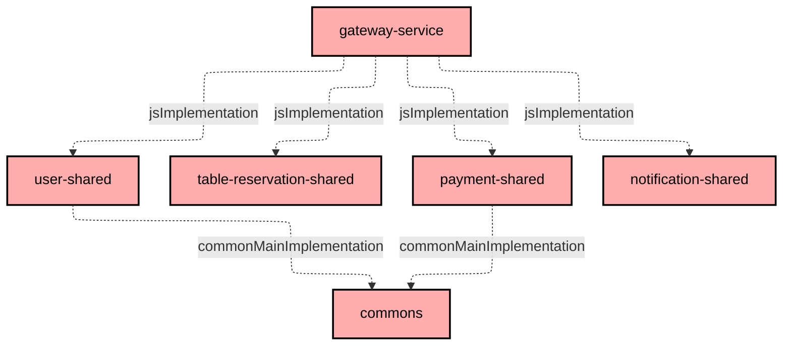

# `:gateway-service`

## Module dependency graph

<!--region graph-->

```mermaid
---
config:
  layout: elk
  elk:
    nodePlacementStrategy: SIMPLE
---
graph TB
  :user-shared[user-shared]:::unknown
  :table-reservation-shared[table-reservation-shared]:::unknown
  :payment-shared[payment-shared]:::unknown
  :notification-shared[notification-shared]:::unknown
  :gateway-service[gateway-service]:::unknown
  :commons[commons]:::unknown

  :gateway-service -.->|jsImplementation| :notification-shared
  :gateway-service -.->|jsImplementation| :payment-shared
  :gateway-service -.->|jsImplementation| :table-reservation-shared
  :gateway-service -.->|jsImplementation| :user-shared
  :payment-shared -.->|commonMainImplementation| :commons
  :user-shared -.->|commonMainImplementation| :commons

classDef unknown fill:#FFADAD,stroke:#000,stroke-width:2px,color:#000;
```
<!--endregion-->
