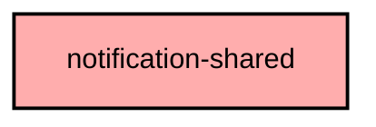

# `:notification-service:shared`

## Module dependency graph

<!--region graph-->

```mermaid
---
config:
  layout: elk
  elk:
    nodePlacementStrategy: SIMPLE
---
graph TB
  :notification-shared[notification-shared]:::unknown

classDef unknown fill:#FFADAD,stroke:#000,stroke-width:2px,color:#000;
```
<!--endregion-->
