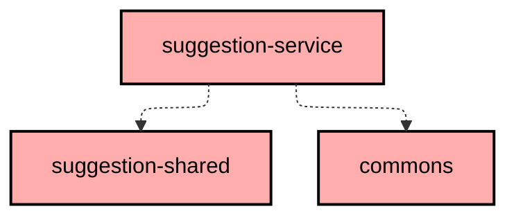

# `:suggestion-service:service`

## Module dependency graph

<!--region graph-->

```mermaid
---
config:
  layout: elk
  elk:
    nodePlacementStrategy: SIMPLE
---
graph TB
  :suggestion-shared[suggestion-shared]:::unknown
  :suggestion-service[suggestion-service]:::unknown
  :commons[commons]:::unknown

  :suggestion-service -.-> :commons
  :suggestion-service -.-> :suggestion-shared

classDef unknown fill:#FFADAD,stroke:#000,stroke-width:2px,color:#000;
```
<!--endregion-->
