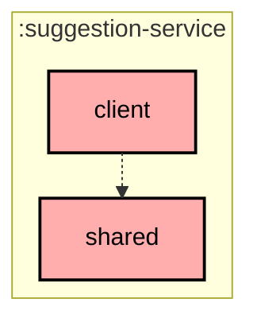

# `:suggestion-service:api`

## Module dependency graph

<!--region graph-->

```mermaid
---
config:
  layout: elk
  elk:
    nodePlacementStrategy: SIMPLE
---
graph TB
  subgraph :suggestion-service
    direction TB
    :suggestion-service:client[client]:::unknown
    :suggestion-service:shared[shared]:::unknown
  end

  :suggestion-service:client -.-> :suggestion-service:shared

classDef unknown fill:#FFADAD,stroke:#000,stroke-width:2px,color:#000;
```
<!--endregion-->
