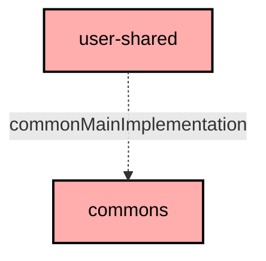

# `:user-service:dto`

## Module dependency graph

<!--region graph-->

```mermaid
---
config:
  layout: elk
  elk:
    nodePlacementStrategy: SIMPLE
---
graph TB
  :user-shared[user-shared]:::unknown
  :commons[commons]:::unknown

  :user-shared -.->|commonMainImplementation| :commons

classDef unknown fill:#FFADAD,stroke:#000,stroke-width:2px,color:#000;
```
<!--endregion-->
